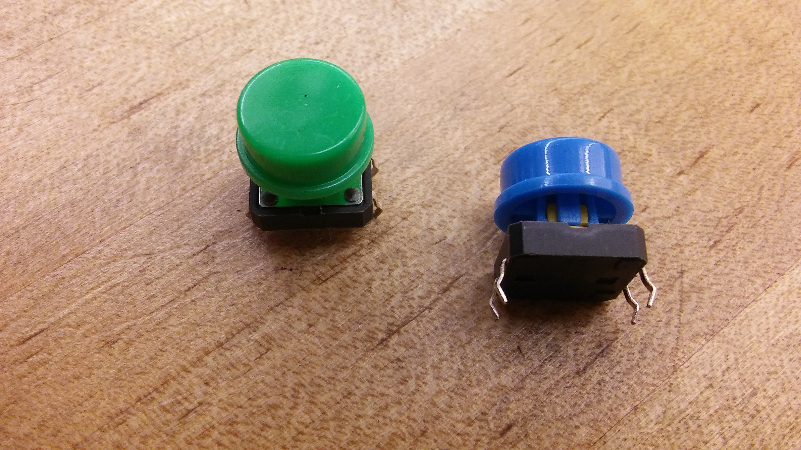
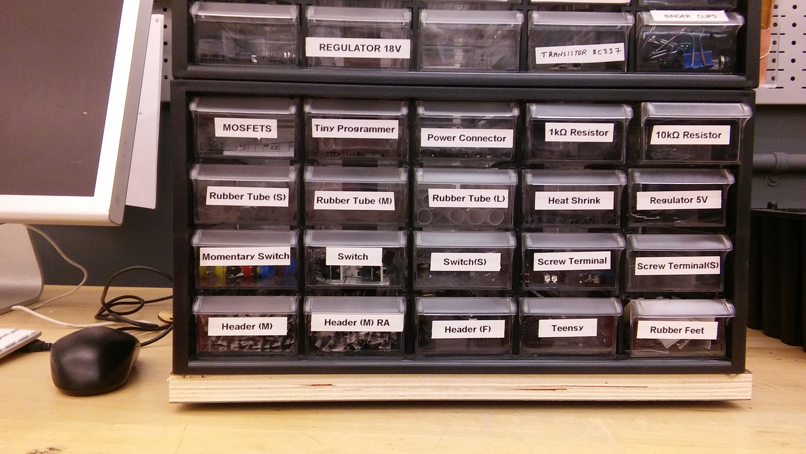
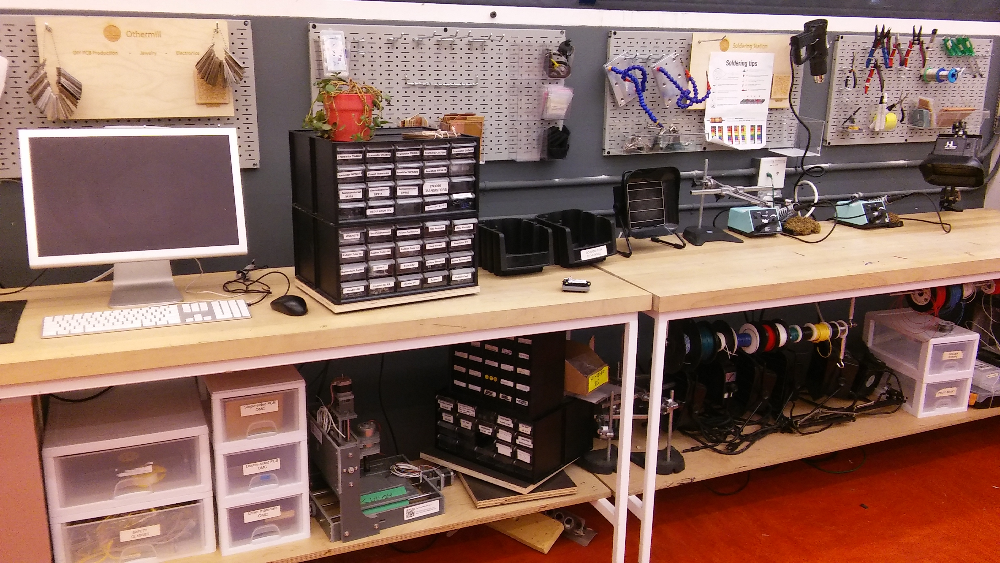
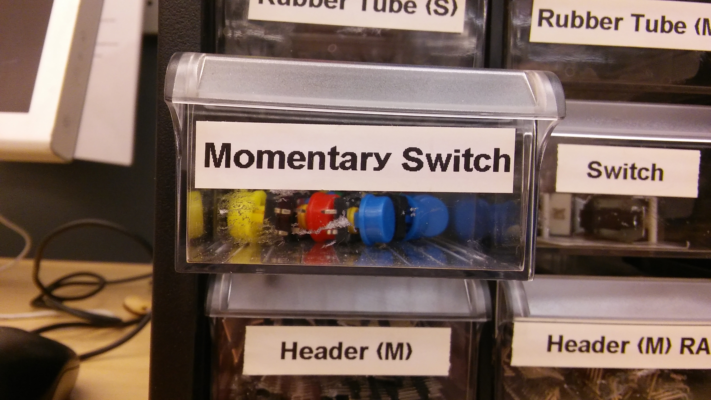

# Mechatronics-Spring-2017
## Mechatronics at California College of the Arts, Spring 2017 

[Current Homework Assignment](#current-homework-assignment)

### Syllabus

* Title: Mechatronics (Graduate Design)
* Class: Tuesdays Noon - 3:00, Room 107 SF Main (SF Hybrid Lab)
* Instructor: Michael Shiloh mshiloh@cca.edu
* Office hours: 
	* Tuesdays and Thursdays 3:00 - 3:30
	* And at other times by appointment

#### Goals
My goal is to teach you how to design, build, and debug mechatronic devices. 
I want to make the course as interesting and relevant as possible for you, 
so please ask questions and bring up topics you are curious about.

#### Github and Class Repository
We will be using a cloud service called Github. Our repository is at
https://github.com/michaelshiloh/Mechatronics-Spring-2017

The class repository will be used to assign homework and reading
assignments, and will contain useful code, libraries, and links to other
resources. Github allows you to receive email updates when a repository
changes — take advantage of this feature!

You will be required to create your own repository for handing in homework and
for project documentation. 

#### Required Textbook
No textbook is required, but there are many good online references and a
few good books out there I can recommend. We also have a good assortment of
books in the library.

#### Prerequisites
* Basic algebra. You should be comfortable with simple equations,
manipulating numbers, fractions, solving for variables, and the
engineering prefixes (micro, milli, kilo, mega, etc.)
* Some understanding of geometry will also be helpful.

#### Requirements and Expectations
* Always bring your computer to class. If you don’t have a computer,
check one out from the Media Center. You will need a computer to
participate, and your grade will be negatively affected if you don’t bring
one.
* Always bring your Arduino, breadboard, jumper wires, etc. to class.
* Participate in class! Ask questions, guess answers, propose topics,
share interesting projects you’ve found, push the envelope, explore your
interests, and teach us all! There are no stupid questions; admitting when
you don’t know something should be a point of pride. Chances are you’re
not the only one with a question, just the bravest one. 
* As outlined in the CCA Student Handbook, attendance in class is mandatory and three or
more unexcused absences will result in a failing grade.
* Plan to spend 3-12 hours a week on homework. If you don’t have a
solid foundation in math you may need more time. Plan ahead!
* Submit your homework on time.  Write clearly and legibly. Attend class, and
don’t be late. These are not requests, these are requirements.
* You are responsible for checking your email and the class repository
for updates.

#### Access & Wellness Services
CCA says:
> Students with disabilities, including disabilities that are not clearly
> evident like chronic diseases or learning disabilities are encouraged
> to notify their instructor after class or during office hours. CCA will
> make reasonable accommodations for persons with documented
> disabilities. Students should contact Suzanne Raffeld, Director of
> Access and Wellness Services (email: sraffeld@cca.edu; phone:
> 510.594.3775), to answer any questions or for assistance. For more
> information, consult CCA's webpage at: http://www.cca.edu/
> students/resources/disability.

I want you to succeed in this class. Please make use of the Hybrid Lab
coaches, the Learning Resource Center, and talk to me if you feel you are
struggling with the material — I can help you do better in this class, but
only if you let me know you need help.

#### Class Format
Sessions will be a mix of lectures, guided labs, and independent work time.
Homework will require research, analysis, and experimentation.
Engineering always takes more time than you think — please make sure to
give yourself enough time!

#### Grading
I will consider the various components of the class in roughly the following proportions:
* 25% Homework & Assignments
* 40% Projects and Project Documentation
* 25% In-Class Hands-on Work and Notebook
* 10% Attendance & Participation

Grading Rubric

**A: Excellent.** You’ve exhibited exemplary conceptual, technical and
perceptual ability implementing projects. You’ve demonstrated a deft
understanding of required readings, and ability to successfully
communicate ideas and processes to others. All work is commented and
clearly demonstrates understanding of each lesson. 

**B: Good.** You’ve completed assignments, and demonstrated a grasp of 
most of the main aspects of each lesson, but not all. You’re able to
communicate information, and step by step processes well. In projects,
conceptual, perceptual, and technical skills are present.

**C: Satisfactory.** You’ve completed the assignments but may lack
enthusiasm or drive to push the work into detailed display of
comprehension. You have not demonstrated comprehensive knowledge of
the application or programming environment. 

**D: Unsatisfactory.** You have not completed the work as assigned.
Substantial problems exist in your work.

**F: Fail.** You did not submit work, or work is below unsatisfactory level.

##### Words of Advice
Exploration is a key part of this class. You’ll get more out of your work if
you
give yourself extra time and have patience. Sometimes you’ll hit a dead
end and have to start over — don’t despair, it happens to everyone, but
give yourself extra time just in case.
This class should be both fun and intense. It’s most fun when you enjoy
what you’re working on, so make a point of taking some time to explore
projects you make want to work on in the future!

#### Required equipment
- Arduino.cc Uno R3 e.g. from
	[Arduino](https://store-usa.arduino.cc/products/a000066) or 
	[Adafruit](https://www.adafruit.com/products/50)). 
	Must be the real thing, not be a clone or a compatible. 
	Do not order from Amazon or Ebay.
- Solderless breadboard, full size (also known as 830 tie point) e.g. from
	[Jameco](http://www.jameco.com/webapp/wcs/stores/servlet/ProductDisplay?search_type=jamecoall&catalogId=10001&freeText=2157706&langId=-1&productId=2157706&storeId=10001&ddkey=http:StoreCatalogDrillDownView)
- Full size USB cable (type A to type B) e.g. from [Jameco](https://www.jameco.com/z/10U2-02203-BK-Cable-USB2-0-A-B-3-Feet-Black-USB-A-Male-To-USB-B-Male_222608.html)
- Pack of jumper wires e.g. from [Amazon](https://www.amazon.com/Solderless-Flexible-Breadboard-Jumper-Arduino/dp/B00ARTWJ44/ref=pd_lpo_328_lp_t_4?ie=UTF8&psc=1&refRID=N9HAJ64FXQ5JZV55JGX3)
- Laptop (Windows, Linux, or Macintosh)
- Dedicated notebook for class notes and project journal

Many vendors grant discounts for educational purposes so ask before you
purchase. I encourage you to organize a group purchase to save on shipping
fees, but do so immediately so we have the equipment on hand.

Remember that Noam gave us
a code that might be good for 10% educational discount at Adafruit. The
code is ADAEDU

Local stores that should carry all these are:
* [Jameco](www.jameco.com) in Belmont, just south of the SFO airport
* [Al Lasher's Electronics](http://allashers.com/) in Berkeley
* I mentioned [Fry's Electronics](www.frys.com) (various locations in South Bay) in class 
but I'm not sure that they carry the official Arduino.

#### Optional equipment
As you develop your projects and interests, you might need to purchase
additional components and devices. This is impossible to predict as the range
of projects you might approach are indeed infinite. At the low end, you can
build amazing projects from discarded electronic devices such as printers at
absolutely no cost; at the high end there is no limit; a complicated robotic
project could easily start at hundreds of dollars. Some lessons I’ve learned:

- Projects will cost more than you think they will
- Projects will take longer than you think they will
- You will order parts that are wrong or that you simply decide not
to use. Be ready to accept this. Consider these items you might
trade with other students (or the larger maker community) for
parts that you do need, especially when you need that part
urgently.
- You will spend less time and money if you are flexible about
your concept. Allow prototype iterations to modify your
concept, not just your execution. The reverse is also true:
If you strongly want to stick to your concept, be prepared to
spend more time and money. The common way of looking at this
is to consider that there is a relationship between time,
money, and features. You can choose any two of them, and the
third will grow (or shrink) to accommodate.

### Schedule

The schedule is subject to change

### Week 1: Tuesday, January 17, 2017
- Introductions
- Interests and goals
- Lecture/Demonstration/Hands-on activity
	- Basic machines
	- Construction techniques
- [Resources](https://github.com/michaelshiloh/resourcesForClasses)
- Homework:
	- Build a mechanical contraption that is activated by a crank
	- Order the required equipment to arrive no later than Friday January 27 so
		that you can complete the homework for week 3. 
	- Create your Github repository using [this
		guide](https://github.com/zamfi/cca-programming-electronics-fall-2016-monday/blob/master/github-guide.md)
		and email me the URL to your repository

### Week 2: Tuesday, January 24, 2017
- Announcements
	- Review schedule
	- Hybrid Lab behavior
- Lecture/Demonstration/Hands-on activity
	- Basic Arduino
		[Tutorial](http://teachmetomake.com/wordpress/arduino-hands-on-intro-workshop)
	- Transistors and Motors 
	- Capacitors if necessary

- Homework:
	- Review the Basic Arduino
	  [tutorial](http://teachmetomake.com/wordpress/arduino-hands-on-intro-workshop)
		  we did in class. Read the entire tutorial, even the parts we didn't do
	- You might want to refer to some other Arduino material. There is plenty
		online, such as the Arduino Resources on
		[this](https://github.com/michaelshiloh/resourcesForClasses)
		page
	- Build a motorized mechanical contraption (either add a motor to last week's
		assignment or build a new one). Control the speed of the motor using
		analogWrite() to prevent damage to your contraption. I recommend starting
		with a very slow speed at first.

		I have created an example Arduino program that just sets the speed
		of the motor and doesn't change anything:
		[setMotorSpeed](https://github.com/michaelshiloh/Mechatronics-Spring-2017/blob/master/examples/setMotorSpeed/setMotorSpeed.ino)

### Week 3: Tuesday, January 31, 2017
- Homework Critique
- Lecture/Demonstration
	- Sensors (limit switches, 
		light sensors, IR proximity, reed switches, magnets)
- Hands-on activity
	- Conditionals
- Demonstration
	- Case study of 
		[constructing mechatronics
		contraption](caseStudy/buildingAContraption)
- Homework:
	- Study the schematic and the code for the contraption I showed in class. 
		It is all detailed [here](caseStudy/buildingAContraption)
	- Study the Arduino Button
		[tutorial](https://www.arduino.cc/en/Tutorial/Button)
	- Using the case study as an example,
		add a switch to your contraption so it moves only when you press the
		switch is pressed. 
		- Switches look like this: 
		- Switches are in this cabinet: 
		- The cabinet is located on this wall:
			
		- Switches are in a drawer labeled _momentary switch_:
			
	- Take a short video of your project 
		and upload it to your Github repository
	- Hand draw a __schematic__ diagram of your circuit 
		take a picture of your schematic (phone is fine)
		and upload it to your Github repository. 

### Week 4: Tuesday, February 7, 2017
- Project critique
- Github [resources](https://github.com/michaelshiloh/resourcesForClasses)
- Review
	- Schematics symbols
	- Circuit and code of 
		[mechatronics
		contraption](caseStudy/buildingAContraption)
- Lecture/Demonstration/Hands-on activity
	- Soldering
- Homework: 
	- Build a simple electrical drawing machine. 
		The only requirement is that it is somehow motorized and that 
		it leaves a mark on a piece of paper.
		You may use Arduino if you wish, 
		but you are not required to. 
		You may use sensors if you wish, 
		but you are not required to. 
		Your drawing may be as complex or as simple as you wish.

### Week 5: Tuesday, February 14, 2017
- Project critique
- Lecture/Demonstration/Hands-on activity
	- Servo motor, stepper motor (look for tutorials e.g. Adafruit or Sparkfun)
	- Blink without Delay
		[tutorial](https://www.arduino.cc/en/Tutorial/BlinkWithoutDelay)
	- Multitasking 
		[tutorial](https://learn.adafruit.com/multi-tasking-the-arduino-part-1?view=all)
	- Complex control [example](examples/multitasking/multitasking.ino)
	- Shields
	- [Construction
		Techniques](http://teachmetomake.com/wordpress/construction-techniques)
- Homework: 
	- Put a picture and a short video of your drawing machine in your Github
		repository
		- Make a new folder in your Github repository for the drawing
			machine project
	- Build an electrical vehicle (2 week project)
		- Must be able to steer in one way or another
		- Can be either autonomous or wired remote control
			- Autonomous: Arduino decides what to do
			- Remote controlled: User tells it what to do 
			- Wired remote control: Whatever the user interacts with (e.g.
				pushbuttons or a joy stick) is connected to the vehicle by wires
			- Wireless remote control: Whatever the user interacts with 
				communicates wirelessly (e.g. Bluetooth, WiFi, or InfraRed) with the
				vehicle. This is complicated and not recommended at this time.
			- Hint: Autonomous is easier because you don't have to build a user
				interface
		- Remember the principle of _Minimum Viable Product_. First get the basics 
			working, then, if you have time, add other features
		- This is a 2 week project. You should have a pretty solid
			prototype or first draft working by next week. Use class next
			week as an opportunity to solve problems.
		- You may check out servo motors and motor shields from the Hybrid Lab if
			you wish
		- As always
			- Email me if you have questions
			- Remember my office hours 3-3:30 on Tuesdays and Thursdays, and 
				at other times if you email me to set it up (but not next week).
			- Make a new folder on your Github repository for this project
			- Put your code in that folder. 
			- Put a schematic in that folder. Hand drawn is fine.  
				If you want to use the schematic capture program that
				I use, get it [here](http:fritzing.org)
	- Additional resources:
		- [Summer
			Robotics](http://teachmetomake.com/wordpress/arduino-robotics-cca-summer2016) class that might have some useful ideas
		- [H-bridge
			tutorial](http://teachmetomake.com/wordpress/arduino-tutorial-h-bridge) in case you want to go that far (allows you to
			reverse your motors, although you are not required to do this)

### Week 6: Tuesday, February 21, 2017
- Work week with Special Guest Lecturer (attendance is mandatory)

### Week 7: Tuesday, February 28, 2017
- Vehicle Project critique 12-1pm
	- 60 minutes / 13 students = 4.6 minutes each
-	Midterm evaluations (2/20-3/3) 1-3pm
	- 120 minutes / 13 students = 9 minutes each
- Homework due __this week__ Friday March 3 at noon. 
	- Write a course- and self-evaluation, 
		email to me by Friday March 3 at noon. 
		__No late assignments will be accepted.__
		- Personal self-evaluation
			- What have you learned?
			- What are your goals for the rest of the semester?
			- What obstacles will you face in achieving these goals?
			- How do you plan to overcome those obstacles?
			- How would you grade your vehicle? 
			- What would you have done differently
				if you had to do the vehicle assignment over again?
		- Course evaluation
			- What further would you like to learn in this course?
			- What would you like to change in the course material?
			- What would you like to change in the way the material is delivered?
			- What would you add to this class?
			- What would you remove from this class?
- Homework due next week. Please read and try to understand as much as
	possible. Be prepared to answer questions in class. It is OK if you don't
	understand everything, but it is not OK if you did not read:
	Read about Edge Detection and Debouncing, Arrays, Debugging, and Soldering 
	in our 
	[resources](https://github.com/michaelshiloh/resourcesForClasses)
	page. 
- Addendum: Homework due next week: Github seems to have repaired their
	file upload problem. Please try to upload your images and videos 
	and let me know if you have any problems.
	If you don't have any problems then you must have your videos and images
	uploaded by our next meeting on Tuesday March 7.

### Week 8: Tuesday, March 7, 2017
- Evaluation feedback
	- Some of you were late. This will affect your grade.
	- English
	- Programming, examples, electronics
- Lecture
	- Coding
		- Functions
		- Libraries
		- Arrays
		- Structuring code
			- (Flow chart)
			- Pseudo-code
- Hands-on activity
	- Servo knob and sweep tutorials
- Homework
	1. I have added links to some resources on functions and arrays to our
		[resources](https://github.com/michaelshiloh/resourcesForClasses)
		page. Please read so that you understand functions better.
		If you prefer videos please search for them and let me know if you find
		anything good.
	3. Check out a servo motor and get a momentary pushbutton switch from the 
			Hybrid Lab. Write a program to do the following:
		1. Create an array of 5 integers 
		2. Initialize the array with 5 arbitrary values between 0 and 180
		3. Each time the button is pressed turn the servo motor 
			to the next entry in the array. You will need to use the 
			edge detection techniques you read about for this week. If you have
			questions about this ask me.
		4. When you reach the last entry in the array, with the next button press
			start over at the beginning.
		5. Upload this program to your Github repository 
			in a new folder called "week8"
  4. Write a concept proposal for your final project
			which must be substantially more complex than the exercises we've done in
			class. 
			Upload this proposal to your Github repository 
			in a new folder called "finalProject"
  5. Read the __Processing__ resources
		shown on our
		[resources](https://github.com/michaelshiloh/resourcesForClasses)
		page
  5. Read the __Classes and Objects__ resources
		shown on our
		[resources](https://github.com/michaelshiloh/resourcesForClasses)
		page

### Week 9: Tuesday, March 14, 2017
- Homework critique
- Lecture
		- Digital Read, if necessary
		- Edge detection
		- Debouncing
		- Counting and modulo
		- Debugging
- Critique proposal concepts
- Homework
	- Complete the programming assignment from last week
		- When the button is pressed and held down, the servo motor should only
			advance once when the button is pressed and then not advance any more
			until the button is released and pressed again
	- Final project proposals and prototype
		- Build a prototype to verify the most difficult part of your project
		- Research 
		- Order or check out equipment
		- Create a very clear project description identifying the Minimal Viable
			Project and optional add-ons
			- Include flow charts, block diagrams, and pseudo-code
	- Improve the quality of your work on Github
		- Well organized Github folders, good folder and file names
		- Good descriptions for each assignment
		- Programs should be:
			- Well organized
			- Properly indented
			- Must include meaningful comments
			- Unused variables and statements should be removed
		- You will be graded on these points

### Spring Break: Tuesday, March 21, 2017

### Week 10: Tuesday, March 28, 2017
- Lecture
	- Fritzing, Othermill
		[tutorial](http://teachmetomake.com/wordpress/how-to-design-a-circuit-board-in-fritzing-and-mill-it-on-the-othermill)
	- Wireless
		- Wifi
			- Arduino [Yun](https://www.arduino.cc/en/Guide/ArduinoYunLin)
			- Arduino [MKR1000](https://www.arduino.cc/en/Guide/MKR1000)
		- Bluetooth
			[tutorial](http://teachmetomake.com/wordpress/adafruit-bluefruit-arduino)
			__Don't solder the module to your project! Add the appropriate header to
			mate with the module.__
		- Sparkfun XBee
			[tutorial](https://learn.sparkfun.com/tutorials/xbee-shield-hookup-guide)
	- Sensor (accelerometer, sound) and LCD display
		- sensors
		- complex program
		- combining examples
		- functions
- Hands-on Demo
	- Arduino/Processing communication
		- Send value from Arduino to Processing
	- Construction techniques
		- Prototyping shields
			- When is it OK to use solid core wires
		- Mounting modules using headers
	- Fritzing

#### current homework assignment
- Homework: 
	- Read the Processing resources in 
		[resources](https://github.com/michaelshiloh/resourcesForClasses)
	- Build any working part of your project 
		(preferably the part you are most concerned about)
		and demonstrate it in class next week

### Week 11: Tuesday, April 4, 2017
- Critique working mock-up
- Lecture: 
	- Basic electronics
		- Voltage, current, resistance
		- Voltage drop over any components
		- Common voltage (parallel)
		- Common current (series)
		- Digital Multimeter (DMM)
	- Smoothing [tutorial](https://www.arduino.cc/en/tutorial/smoothing)
- Reminder
	- I am out of town next week but we do have a substitute
- Demo
		- Attaching wires to header pins and sockets 
			- When must you use stranded wires
- Homework: __Working__ minimal viable project due week 13

### Week 12: Tuesday, April 11, 2017
	- Passover: work week

### Week 13: Tuesday, April 18, 2017
- Demonstrate working minimal viable project
- Homework: Refine

### Week 14: Tuesday, April 25, 2017
- Final project critique

### Week 15: Tuesday, May 2, 2017
- No class;  End of Year Reviews for Year Zero and Year One

Interface show, Saturday May 6th

## Student Repositories

[Jeffrey Stone](http://github.com/JeffreyStone/jeffrey)  
[Shiyu Zhang (Raine)](http://github.com/Raineshiyuzhang/Raine-Shiyu-Zhang-)  
[Xueting Wang (Vivian)](https://github.com/vivwang/hw1)  
[Siyu Zhang (Sirry)](https://github.com/sirryzhang/Siyu-Zhang)  
[Benner Boswell](https://github.com/bennerboswell/week3-homework-)  
[Jonathan Simmons](https://github.com/JonSimmons4/hw1)  
[Alexander M. Kane](https://github.com/alexmkane/mechatronics)  
[Alexander E. Kozachek](https://github.com/AeKozachek/HW1)  
[Xiaodong Ma (Andy)](https://github.com/xiaodongma0217/Mechatronics_Andy_2017)  
[Dan Qian (Dawn)](https://github.com/danqian/homework1)    
[Hao Sui (Evan)](https://github.com/evansui/homework)  
[Fei Wang (Vicky)](https://github.com/feiwangvicky/hw)  
[Yan Yan](https://github.com/yyanyan/yan)  
[Bhavin](https://github.com/bhavinnagda)  
