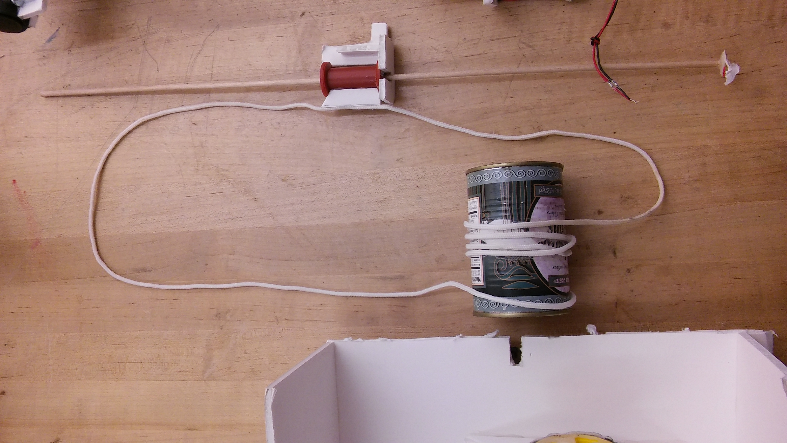
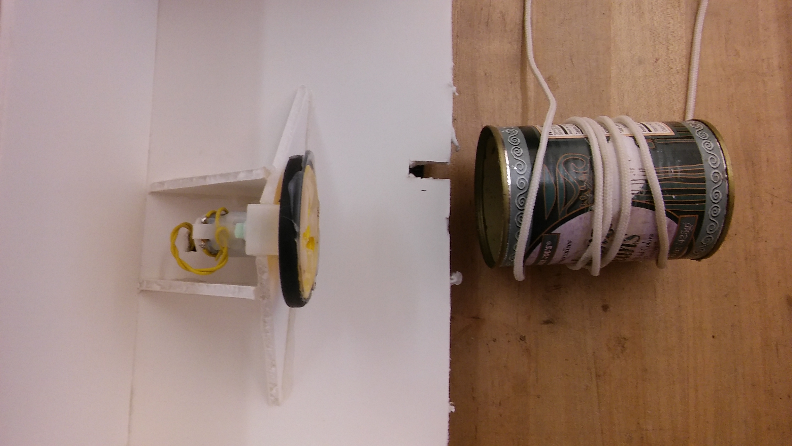
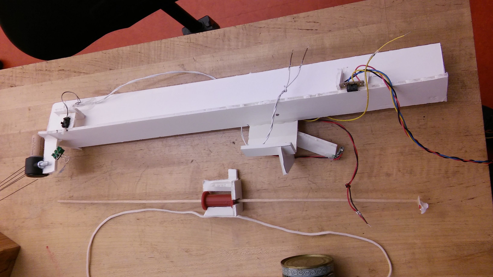
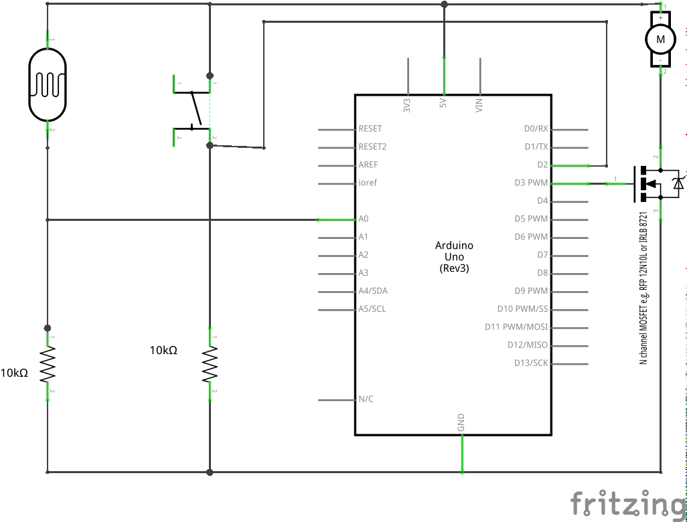
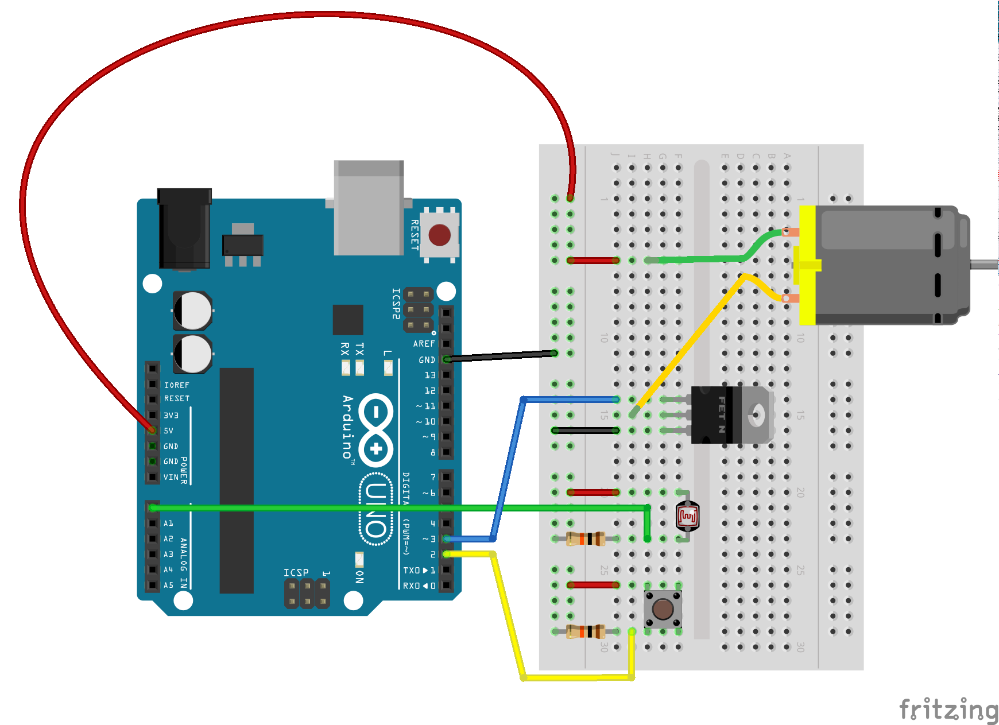

1. First plan for elevator: Frame was foam core, elevator was spool on wooden
dowel, and cord ran  around a pulley at the top and bottom:

cord was pulled by a motor attached to tin can around which the cord was
wound:

support structure, showing pulleys of chair casters with corks on which the 
cord ran:

Tried various sensors:

Laser pointer and LDR
IR Proximity
2 different mechanical limit switches

Problem: Terribly unstable, sensors almost never activated

2. Second plan: decided to use mechanism I had harvested from a printer. Since
the mechanism was attached to a metal dowel, it always moved exactly in the
same line. I figured this would help my sensors sense more reliably.

  1. Test motor by hooking up directly to 5V and GND from Arduino. It worked.

  2. See if I can slow down the motor using analogWrite(). Need a transistor. 

By trial and error I discovered that the slowest I could go was 220!

  3. To avoid the motor always running I added a switch and the necessary
[code](code/testMotorWithSwitch/testMotorWithSwitch.ino)

  4. Build a frame and attach sensor. Use analogReadSerial example to make
sure reading changes properly. Discovered I needed a tube to block ambient light.

  5. Discovered motor has to move really slowly or sensor reading isn't caught!
Added serial.println() in order to catch that

  6. Discovered light went through gaps in mechanism so added foam core to
block the light.
Now can go faster. This lead me to notice a mistakes in my program. Here is
the final
[program](code/testMotorWithLightSensor/testMotorWithLightSensor.ino)

Here is the final schematic 

And here is the breadboard view

Lessons learned:

1. Don't make it bigger than wherever you plan to store it, or make it so you
can take it apart

2. don't overthink - start building quickly

3. Test each component (motor, switch, sensor) separately and then combine
code for the whole project

3. don't put electronics underneath or in a covered area - you will need
easy access

4. Arduino takes time to respond to a sensor. 
	- Either make motion slow 
		or make sure sensor is activated for a long time
	- Make sure sensor isn't too close to the end so if it keeps moving a bit
		nothing breaks

5. Take a picture or video of your project as soon as it works in case it
breaks
